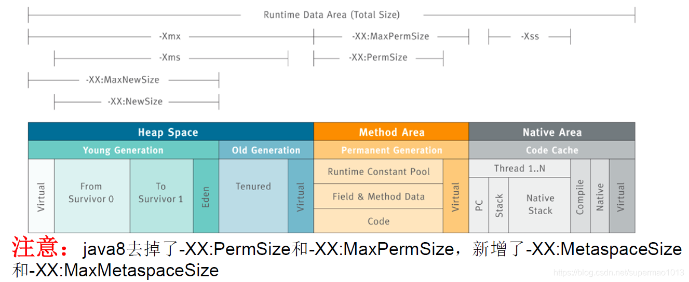

-Xmx5g：设置堆最大内存为5G

-Xms5g：设置堆最小内存为5G，将最大和最小值设置一样，可以避免堆自动扩展，即垃圾回收后会重新分配堆内存空间，提高性能，一般也推荐这么做

-Xmn2g：设置堆中的年轻代大小为2G。整个堆大小=年轻代大小+老年代大小+持久代大小。持久代一般固定位64M，所以增大年轻代后，将会减少老年代大小，当老年代内存用完会引发Full GC，相当严重。此值对系统性能影响较大，Sun官方推荐配置为整个堆的3/8

-XX:SurvivorRatio=8：设置年轻代中Eden区与一个Survivor区的比例为8:1，默认为8

-XX:NewRatio=2：设置老年代和年轻代比例大小2:1，默认为2

-Xss128k：设置每个线程的栈大小。JDK5.0以后每个线程栈大小为1M，以前每个线程栈大小为256K。在相同物理内存下，减小这个值能生成更多的线程。但是操作系统对一个进程内的线程数还是有限制的，不能无限生成，经验值在3000-5000左右

-XX:PermSize -XX:MaxPermSize（JDK1.7）：设置永久代大小，jvm启动时，永久区一开始就占用了PermSize大小的空间，如果空间还不够，可以继续扩展，但是不能超过MaxPermSize，否则会OOM PermSiz space

-XX:MetaspaceSize -XX:MaxMetaspaceSize（JDK1.8）：设置元空间的初始值和最大值

-XX:+HeapDumpOnOutOfMemoryError –XX:HeapDumpPath=F:\ ：调试用，可以让虚拟机在出现溢出内存异常时Dump出当前的内存堆转储快照以便时候进行分析, HeapDumpPath是指定文件存放路径。

-XX:MaxDirectMemorySize=10M：设置直接内存大小，如果不指定，则默认与Java堆最大值（-Xmx）一样。NIO操作会占用直接内存，因此大量的NIO操作可能引起直接内存溢出：Direct buffer memory

-XX:PretenureSizeThreshold=3145728：表示超过3M的数据直接在老年代中保存

-XX:MaxTenuringThreshold=30：设置年轻代中的对象存活多少次Minor GC后进入老年代。如果设置为0的话，则年轻代对象不经过Survivor区直接进入年老代。对于年老代比较多的应用，可以提高效率。如果将此值设置为一个较大值，则年轻代对象会在Survivor区进行多次复制，这样可以增加对象在年轻代的存活时间，增加在年轻代即被回收的概率。设置为30表示一个对象如果在Survivor空间移动30次还没有被回收就放入年老代。

-XX:+UseParNewGC：设置年轻代为并行收集。可与CMS收集同时使用。JDK5.0以上，JVM会根据系统配置自行设置，所以无需再设置此值

-XX:ParallelGCThreads=8：配置并行收集器的线程数，即：同时多少个线程一起进行垃圾回收。此值最好配置与处理器数目相等

-XX:+PrintGCTimeStamps：打印GC停顿时间，一般测试用

-XX:+PrintGCDetails：打印GC详细日志，一般测试用

如果满足下面的指标，则一般不需要进行GC优化：

Minor GC 执行时间不到50ms
Minor GC 执行不频繁，约10秒一次
Full GC 执行时间不到1s
Full GC 执行频率不算频繁，不低于10分钟1次