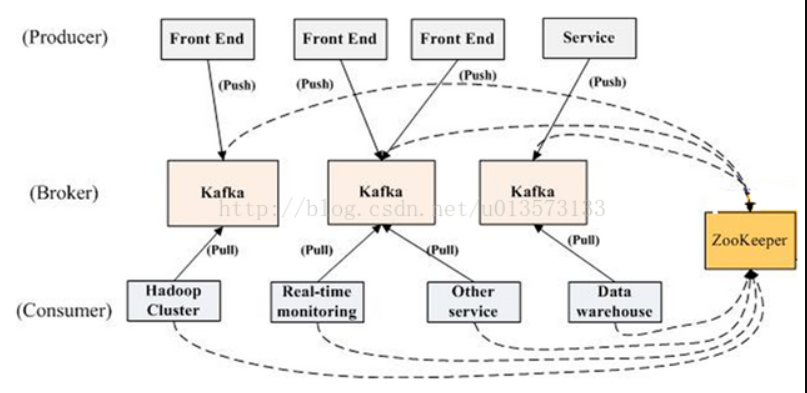

# KAFKA

### 观察者模式、发布-订阅模式

在述说kafka之前，我们有必要了解下观察者模式和发布订阅模式，当一个对象需要根据另一个对象状态变化做出反应时，最直接的方法是观察对象时刻去查看被观察者的状态，并在状态改变时做出反应。但这样做缺点有需要时刻去查看状态消耗CPU，当有多个被观察者时，时刻关注多个被观察对象可能导致观测不及时。此时观察者模式可派上用场，该模式下，不是观察者主动去观察被观察者，而是被观察者维护了一个观察者队列，在自身状态改变时主动去提醒观察者做出相应。 这样观察者就不许时刻去观察被观察者而变成事件-相应的一种模式，效率大大提高，并且也不会反应不及时或者漏看。但当被观察者维护的观察者队列太多时同样也会出现问题，这样被观察者需要遍历一遍观察者队列去提醒他们。从事件产生-事件派发-事件响应，显然事件产生和事件响应能被很快处理，因为它们的复杂度是O(1)，而派发事件复杂度时O(n)。此时我们可以将派发从被观察者中解耦出去，用一个分布式的调度工具去完成派发工作，这样整个流程传递的速度就很快，而这种模式就是发布订阅模式，由发布者，事件管道，订阅者三者组成。而kafka就是其中事件管道的实现之一。

### KAFKA结构

下图就是就是kafka的结构示意图，Kafka集群依靠zookeeper通信实现高可用的主从架构，生产者往kafka发布消息，消费者从kafka拉取消息。首先对kafka的一些概念解释。

Broker是kafka的一个实例，一般多个实例分布在不同机器实现高可用和起到分流作用。一个broker有所有topic的主或从节点。topic是一个发布订阅的主题，是一种逻辑概念，一个主题专门负责传递特定的主题消息。一个主题可以分为多个partition分支。partition即分区，是具体的一个队列，消息交互的实际对象，一个主题分为多个partition可起到分流作用。

### 主从同步数据的过程

kafka采用的是主从架构，消费者读数据可以从任意节点，但生产者写数据只能写入主topic节点，以下是kafka写数据的过程。

### 数据持久化结构

数据的实际存储单位是segment，一个partition由多个segment组成，segment有大小上限，超出部分则另起一个segment。segment以该segment起始offset命名，查找的时候可以快速定位到某个segment。segment对应的索引文件为.index后缀的文件，有offset索引和时间索引两种索引文件。其中offset索引采用稀疏索引，并用mmap方式操作数据，效率高。只有被持久化到硬盘的数据才能被消费。

kafka用文件存储消息，所以依赖磁盘效率。kafka本身的内容是顺序插入的，在持久化的时候对日志文件进行append操作即可，不需要检索方面的开支，所以它的写效率是很高的。

tip：read，write操作进程会将数据拷贝至系统IO缓存空间，flush后进入磁盘。mmap操作时建立进程内存空间到磁盘的映射，这样将数据复制到进程中指定映射的空间中就行，减少了一次拷贝过程。

### 应用场景

一个典型的Kafka集群中包含若干Producer（可以是web前端FET，或者是服务器日志等），若干broker（Kafka支持水平扩展，一般broker数量越多，集群吞吐率越高），若干ConsumerGroup，以及一个Zookeeper集群。Kafka通过Zookeeper管理Kafka集群配置：选举Kafka broker的leader，以及在Consumer Group发生变化时进行rebalance，因为consumer消费kafka topic的partition的offsite信息是存在Zookeeper的。Producer使用push模式将消息发布到broker，Consumer使用pull模式从broker订阅并消费消息。

### 重复消费问题

kafka消费者拉数据分两步，第一步拉取特定位置数据，然后更新offset至拉去后位置。如果更新位置没成功，下次拉去会从之前位置拉取造成消息重复。可以不采取自动更新offset方式，用事务自己实现读数据和offset更新的一致，或者加个自增字段标记最新消息版本，拉取消息时检验下消息版本是否是最新版本，或者采取幂等性的操作。出现重复消费的情况是自动提交没成功，比如机器宕机，网络差或连接断开。

### 参考文章

官方文档：http://kafka.apache.org/documentation/#operations

简书：https://www.jianshu.com/p/d3e963ff8b70

kafka入门解析：https://www.cnblogs.com/sujing/p/10960832.html

超详细kafka解析：https://www.jianshu.com/p/734cf729d77b

kafka重复原因及解决方案：https://cloud.tencent.com/developer/article/1665700