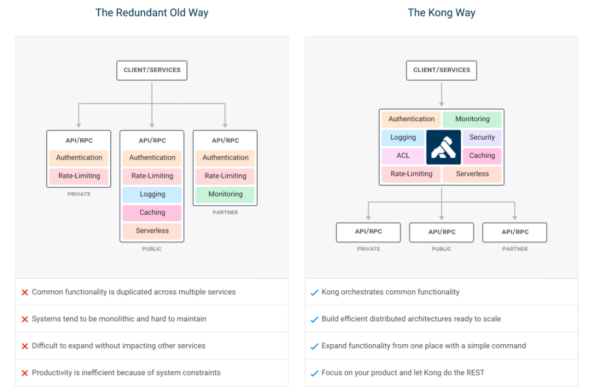
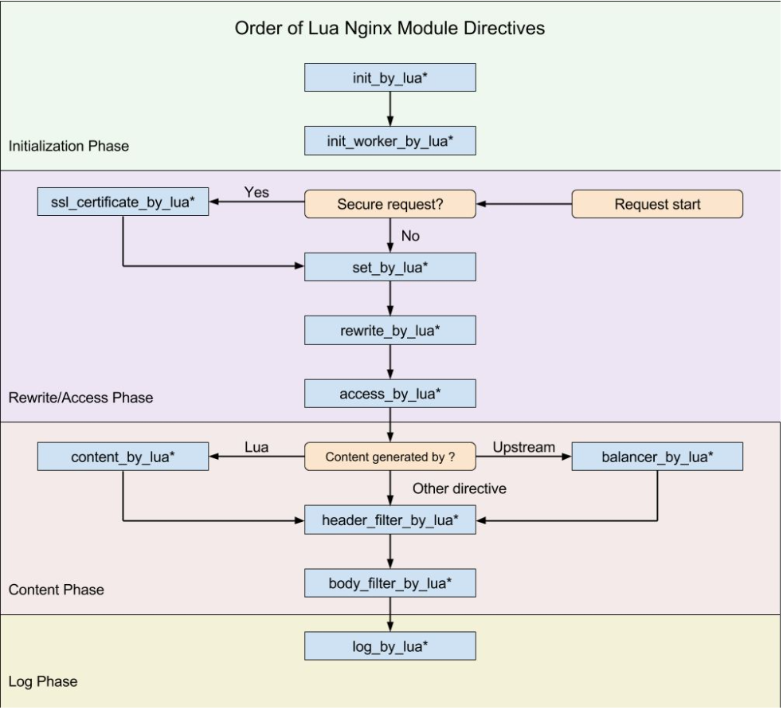

Kong网关
网关技术一般以后我们在用户请求和后台api之间加上一层控制层，用于进行一些流量监控，负载均衡，日志记录，权限控制等操作。在单系统时代我们或许可以用简单的网关或直接在系统内部加入拦截器控制。但随着微服务的兴起，一个大型系统涵盖的域名，机器越来越多。在每一个微服务中都加入一致的网关控制逻辑都不太现实，于是就需要一个独立出来的网关系统用于统一的入口，Kong就是如此。
Kong依赖nginx实现，集合了 脚本，实现了更强的网关控制。

nginx是一个轻量级的web服务器，它是一个高性能http和反向代理服务器。常用场景是用nginx做静态资源服务器和反向代理，转发请求到内部的后台服务器中，在配合lua实现限流，熔断等逻辑。nginx做反向代理时负载均衡的策略有以下几种。

1. 轮询
2. 加权轮询
3. IP hash
4. fair 响应时间短优先分配(第三方)
5. url_hash(第三方)

OpenResty

nginx本身功能有限，只能做简单的静态资源服务器和反向代理，但是配合lua脚本语言，lua嵌入nginx中就能实现日志、限流、灰度、安全验证等逻辑，使nginx更加强大。而OpenResty 就是基于Nginx与Lua的高性能Web平台，带有很多优秀的Lua库，可以做动态服务网关。就像js于html一样，浏览器暴露了html的一些对象如document给js操作，因此js脚本能通过暴露对象操作html。lua于nginx同样如此，nginx在整个生命周期暴露了不同的对象，lua脚本通过操作nginx对象实现自身逻辑。实际使用中我们可以在nginx的conf文件中加入相关lua脚本实现逻辑。

参考文章

微服务与API 网关(上)为什么需要API网关？https://mp.weixin.qq.com/s/XTzRr0eR6ybpNFGJ57cVkA

微服务与API 网关(下) 为什么需要API网关？https://mp.weixin.qq.com/s/Woktbld0-7bd73ySmVA3ug

